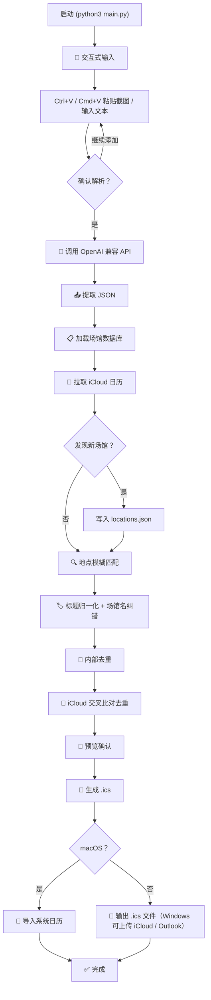

# 🏸 calendar-event-generation

[](https://github.com/CooperZhuang/calendar-event-generation/blob/main/pyproject.toml)
[](https://www.python.org/downloads/)
[](LICENSE)

AI 日程解析 → `.ics` 日历事件，一键导入 Apple / Google / Outlook 日历。

支持 **macOS / Windows** 双平台：macOS 可直接导入系统日历；Windows 生成 `.ics` 后上传到 iCloud 网页版 / Outlook 等。

## 为什么有这个项目

日常收到大量碎片化的日程信息——微信群截图、活动海报、邮件通知、订场确认。手动录入日历又慢又容易出错，尤其是场馆地址要在 Apple Maps 里手动搜索定位，每次都得反复放大缩小确认。

现在只需要一步——把截图 Cmd+V / Ctrl+V 粘贴进内置 AI 模式，自动完成「识图 → 提取日程 → 生成带精确地图坐标的 `.ics` → 导入系统日历」。

## 快速开始

```bash
git clone https://github.com/CooperZhuang/calendar-event-generation.git
cd calendar-event-generation

# 1. 配置 API Key
cp .env.example .env      # 编辑 .env，填入 OPENAI_API_KEY（兼容任意 OpenAI 接口）

# 2. 安装依赖
pip install openai        # 或直接双击运行 run_ai.sh，自动完成环境准备

# 3. 启动（默认 AI 模式）
python3 main.py
```

**macOS**：可直接双击项目根目录的 `run_ai.sh`，自动进入 AI 模式。

**Windows**：

```powershell
# 2. 安装依赖（使用项目自带 venv）
.venv\Scripts\python.exe -m pip install openai
# 或直接双击运行 run_ai.sh（自动完成环境准备）

# 3. 启动
.venv\Scripts\python.exe main.py
```

> Python ≥ 3.11。macOS 可直接导入日历应用；Windows 生成 `.ics` 文件，可在 iCloud 网页版（日历 → 设置 → 导入日历）或 Outlook 中导入。

## 特性
- **AI 识图解析** — Ctrl+V（macOS: Cmd+V）粘贴截图/海报/订场确认，自动提取日程；兼容任意 OpenAI 接口（DeepSeek、Qwen 等）
- **多图累积** — 可连续粘贴多张图片，确认后一次性解析
- **智能地点匹配** — 预设场馆数据库，模糊匹配 + Apple Maps 精确定位
- **自动发现新地点** — iCloud 事件中未知场馆自动提取入库
- **双重去重** — 输入内部去重 + iCloud 日历交叉比对
- **标题归一化** — "羽毛球活动""打羽毛球" → "羽毛球"；AI 误把场馆名当标题时自动纠正
- **退款过滤** — AI 识别到"已退款"的日程自动忽略
## 运行流程



## 🤖 AI 图片/文本解析
### 方式一：`--ai` 内置模式（推荐）

Ctrl+V（macOS: Cmd+V）粘贴截图，程序自动检测剪贴板并累积多张图片，确认后一次性 AI 解析生成 `.ics`：

```bash
# 1. 配置 API Key
cp .env.example .env      # 编辑 .env，填入 OPENAI_API_KEY（兼容任意 OpenAI 接口）

# 2. 安装依赖
pip install openai

# 3. 启动（默认 AI 模式；macOS 可直接双击 run_ai.sh；Windows 用 .venv\Scripts\python.exe main.py）
python3 main.py
```

```
🤖 AI 日程解析模式
模型: gpt-4o | API: https://api.openai.com/v1

📋 图片/文本 > [Ctrl+V 粘贴截图 → 自动检测并读取剪贴板]
  📋 检测到剪贴板图片，读取中...
  ✅ 已读取剪贴板图片 (324158 字节) [累计 1 张]
  还要添加更多图片吗？[回车=添加 / n=解析生成ics]  [回车继续 Ctrl+V]

📋 图片/文本 > [Ctrl+V 粘贴第二张]
  ✅ 已读取剪贴板图片 (298401 字节) [累计 2 张]
  还要添加更多图片吗？[回车=添加 / n=解析生成ics] n

⏳ 正在调用 AI 解析 (2 张图片)...
✅ 解析到 3 个日程

📋 图片/文本 > d
→ .ics 已保存: schedule.ics
```

也支持直接粘贴文本（非结构化日程描述）、输入文件路径。兼容 DeepSeek、Qwen 等任意 OpenAI 兼容接口。

### 方式二：手动复制 Prompt

把活动海报、微信群截图发给 ChatGPT / Claude 时使用以下 Prompt：

<details>
<summary>📋 点击展开完整 Prompt</summary>

```
# 角色与任务

你是一个极其严格、具备高泛化能力的通用日程事件解析器。请接收图片 OCR 结果或任意结构化的日程文本输入，将其解析为标准化的 JSON 输出，供下游程序自动生成标准日历 .ics 文件。

# 核心约束

1. 必须且只能输出一个合法的 JSON 字符串。
2. 严禁包含任何解释性文字、前后缀，严禁将 JSON 包裹在 ```json ... ``` 等 Markdown 代码块中。

# 上下文基准（用于推算相对时间和缺失的年份）

- 当前系统时间：{{CURRENT_TIME}} （请程序调用时动态替换，例如：2026-05-26 Tuesday）

# 输出 JSON 格式

[{
  "title": "字符串，活动本身的名称或类型（如 \"羽毛球\"、\"同学聚会\"、\"部门周会\"）。严禁使用地点、场馆、商户名称作为标题；若没有明确活动名，请根据内容推断活动类型作为标题，绝不留空",
  "start_date": "YYYY-MM-DD 格式。若输入无显式年份，则默认使用 `# 上下文基准` 中的年份",
  "start_time": "HH:MM 格式，24小时制。若是全天活动，设为空字符串 \"\"",
  "end_date": "YYYY-MM-DD 格式。跨天事件需根据时间差自动计算并调整日期",
  "end_time": "HH:MM 格式，24小时制。若是全天活动，设为空字符串 \"\"",
  "is_all_day": 布尔值,
  "location_name": "字符串，事件发生具体的地点、场馆、房间或会议室名称。如果没有明确地点，设为空字符串 \"\"",
  "description": "字符串，将文本中所有不属于时间、地点的非核心关键信息（如备注、费用、参与人、座位号、组织者等），按 '原文字段名：具体值' 的格式用 \\n 拼接输出。若无任何附加信息，设为 \"\""
}]

# 解析与推算规则

## 1. 时间解析规则（核心）

- **格式化规范**：日期必须严格为 "YYYY-MM-DD"，时间必须严格为 "HH:MM"。
- **相对时间推算**：依据 `# 上下文基准` 提供的当前时间，准确推算诸如"今天"、"明天"、"本周五"、"下周三"的具体公历日期。
- **全天活动判定**：若输入只有日期，完全没有提及任何具体整点时间（例如："6月1日儿童节"、"本周五团建"），则判定 `is_all_day = true`，且 `start_time` 和 `end_time` 填充为 `""`。
- **自动跨天处理**：若结束时间在数值上小于开始时间（例如：22:00 - 02:00），默认视为跨越到次日，`end_date` 必须在 `start_date` 的基础上自动加 1 天。

## 2. 地点提取规则

- 准确提取文本中代表空间位置的文本（如"1号会议室"、"百丽宫影城5号厅"、"奥埔篮羽运动中心"）。
- **不要**在提示词中硬编码任何特定场馆。保持对原始地点的无损提取。

## 3. 描述生成规则

- 提炼所有零散的附加信息。例如输入中含有"票价：50元，座位：3排2座"，需转换为 `"description": "票价：50元\n座位：3排2座"`。

## 4. 上下文规则

- 不考虑上下文，我会一次性把所有图片发给你，历史对话对你来说没有意义

## 5. 去重

- 给到的图片可能包含重复的日程，自动去除

## 6. 特殊状态

- 如果提到已退款，则应该忽略跳过，不要输出这部分

## 7. 标题提取规则（核心）

- 标题必须代表"活动本身"的名称或类型，例如：羽毛球、同学聚会、部门周会、看牙医。

- 严禁将地点/场馆/商户/餐厅等场所名称用作标题（如"奥埔篮羽运动中心"、"海底捞火锅"均属非法标题）。

- 若原文没有明确活动名，根据内容推断活动类型作为标题：场地是羽毛球馆 → 标题为"羽毛球"；餐厅聚会 → 标题为"聚餐"。

- 标题保持简短（2~8 字为宜），不得包含时间、地址等非标题信息。
```

</details>

将 Prompt 中的 `{{CURRENT_TIME}}` 替换为当日日期（如 `2026-05-28 Wednesday`），与截图一起发给 AI。将返回的 JSON 直接粘贴进 `python3 main.py` 的 AI 模式文本输入，或手动核对后使用。

## 配置

复制模板并填入真实值：

```bash
cp .env.example .env
```

| 变量 | 说明 | 必填 |
|------|------|------|
| `CALENDAR_URL` | iCloud 日历发布链接（去重 + 发现新地点） | 否 |
| `OPENAI_API_KEY` | AI 解析 API Key | 必填 |
| `OPENAI_BASE_URL` | 兼容接口地址，默认 `https://api.openai.com/v1` | 否 |
| `OPENAI_MODEL` | 模型名，默认 `gpt-4o` | 否 |

## 项目结构
```
main.py                        # AI 模式入口
run_ai.sh                      # 一键启动脚本（macOS 双击运行；Windows 用 .venv\Scripts\python.exe main.py）
schedule_agent/                # 核心包
├── __init__.py
├── ai_parser.py               # AI 图片/文本解析（OpenAI 兼容接口）
├── cli.py                     # AI 交互模式（剪贴板检测、多图累积）
├── config.py                  # 环境变量读取
├── events.py                  # 事件构建、标题纠错、去重、日历导入
├── ics_utils.py               # ICS 文件生成
└── locations.py               # 场馆坐标匹配、自动发现新地点
data/
└── locations.json             # 场馆数据库
tests/
├── test_all.py                # 63 项测试
└── fixtures/schedule.json
.env.example                   # 配置文件模板
```

## License

MIT © Cooper Zhuang
